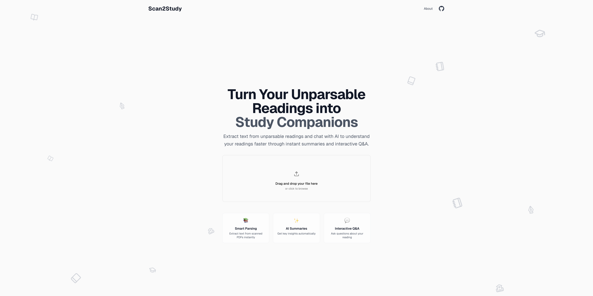

# Scan2Study

---

## 🚀 Overview  
**Scan2Study** turns scanned or non-machine-readable PDFs—like old course readings—into a clean chat-based study assistant.  
Upload a PDF → automatic OCR → instant summary → ask contextual questions → optionally download the raw text.

It’s built for students who want to understand readings faster without the hassle of manually converting files or copy-pasting text into an AI model.

---

## 💡 Why I Built This  
Many university readings—especially older scanned PDFs—can’t be parsed directly by AI tools.  
I kept running into situations where I wanted to use Claude or ChatGPT to help me study, but the text wasn’t extractable without multiple annoying steps.  
Scan2Study removes that friction by instantly parsing the document and turning it into an interactive study companion.  
The goal is to help students focus on learning, not file formats, and make AI genuinely useful for real coursework.

---

## ✨ Features  
- 📥 Upload scanned or unreadable PDFs  
- 🔍 Automatic OCR and text extraction  
- 🧠 Automatic summary generated with Claude  
- 💬 Full chat interface to ask questions about the reading  
- 📄 Download raw `.txt` version of the parsed text  
- ⚡ Clean, fast, and student-friendly design

---

## 🛠️ Tech Stack  
- **Next.js 14 (App Router)**  
- **React + TypeScript**  
- **TailwindCSS**  
- **OCR.space** (free OCR API)  
- **Anthropic Claude 3.5** (summaries + Q&A)  

